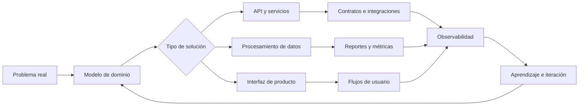

<div align="center">

# Felipe Castillo

### Desarrollo sistemas que conectan datos, producto y operación

Transformo procesos complejos en **APIs**, **automatizaciones**,  
**productos de datos** e **interfaces útiles para las personas**.

<br />

<div align="center">

<p>
  <a href="https://github.com/PipeFck">
    
  </a>
  <a href="https://www.linkedin.com/in/felipe-castillo-12310a358/">
    
  </a>
</p>


</div>

</div>

---

## 👨‍💻 Sobre mí

Soy Ingeniero Civil en Computación, egresado de la Universidad de Talca, con foco en sistemas donde los datos necesitan **moverse, validarse, transformarse y convertirse en decisiones o acciones**.

Me interesa trabajar sobre el ciclo completo de una solución:

- Comprender el problema y modelar el dominio.
- Diseñar APIs, contratos e integraciones.
- Construir procesos de datos y automatizaciones.
- Crear reportes, paneles y flujos operativos.
- Desplegar, observar y buscar oportunidades de mejora en el sistema.
- Explorar cómo la inteligencia artificial puede mejorar productos, procesos y experiencias de usuario.

---

## 🧩 Mi perfil técnico

<table>
  <tr>
    <td width="25%" valign="top">
      <strong>🧠 Diseño de sistemas</strong>
      <br /><br />
      Modelado de dominio, separación de responsabilidades, contratos y evolución de arquitectura.
    </td>
    <td width="25%" valign="top">
      <strong>⚙️ Backend y APIs</strong>
      <br /><br />
      Servicios mantenibles, lógica de negocio, Node.js, integraciones y procesamiento.
    </td>
    <td width="25%" valign="top">
      <strong>📊 Datos y analítica</strong>
      <br /><br />
      ETL, validación, transformación, BigQuery, observabilidad, métricas y productos de datos.
    </td>
    <td width="25%" valign="top">
      <strong>🖥️ Producto e interfaces</strong>
      <br /><br />
      Aplicaciones con React, paneles, back office, flujos operativos y herramientas orientadas al usuario.
    </td>
  </tr>
</table>

---

## 🔄 Cómo convierto un problema en un sistema



Mi objetivo es construir soluciones que sean **comprensibles, trazables, mantenibles y útiles**.

---

## 🛠️ Experiencia aplicada

| Área | Qué construyo | Qué priorizo |
|---|---|---|
| **Sistemas de datos** | Procesos ETL, normalización, validaciones y monitoreo | Trazabilidad, calidad y recuperación ante errores |
| **Backend** | APIs, servicios, reglas de negocio e integraciones | Contratos claros, mantenibilidad y evolución |
| **Reporting y analítica** | Reportes, métricas, consultas y productos de datos | Consistencia, contexto y utilidad |
| **Producto e interfaces** | Aplicaciones con React, paneles, back office y flujos internos | Claridad, velocidad y reducción de fricción |
| **Automatización** | Tareas recurrentes, sincronizaciones y procesos asistidos | Confiabilidad, control y ahorro de trabajo manual |
| **Inteligencia artificial** | Exploración de asistentes, automatizaciones y funcionalidades enriquecidas con IA | Aplicación práctica, evaluación y mejora continua |
| **Entrega** | Cloud, control de versiones y automatización de workflows | Repetibilidad, visibilidad y mejora continua |

---

## 🧰 Tecnologías

<div align="center">


</div>

<br />

| Enfoque | Tecnologías y herramientas |
|---|---|
| **Producto e interfaz** | TypeScript, React, Next.js, Tailwind CSS |
| **Backend y servicios** | Node.js, Python, Go |
| **Datos y analítica** | BigQuery, ETL, modelado, validación, reporting y observabilidad |
| **Cloud y entrega** | Google Cloud Platform, AWS, Git y GitHub Actions |
| **Automatización** | Integraciones, procesamiento de datos y flujos operativos |
| **Inteligencia artificial** | Modelos generativos, asistentes, automatización asistida y evaluación de resultados |

---

## 🤖 Inteligencia artificial aplicada

Actualmente estoy profundizando en inteligencia artificial desde un enfoque práctico, orientado a comprender cómo integrarla de manera responsable en productos, herramientas y procesos reales.

Mis principales áreas de aprendizaje e interés son:

- Integración de modelos de lenguaje en aplicaciones.
- Creación de asistentes para consultar, analizar y explorar información.
- Automatización de tareas repetitivas mediante inteligencia artificial.
- Generación y enriquecimiento de reportes.
- Mejora de experiencias de usuario mediante interfaces asistidas.
- Evaluación, trazabilidad y control de las respuestas generadas.
- Aplicación de IA como apoyo a la toma de decisiones.
- Optimización continua de flujos de trabajo técnicos y operativos.

Mi objetivo es utilizar la inteligencia artificial como una **capacidad integrada al producto**, enfocada en resolver problemas concretos y generar mejoras medibles.

---

## 🎯 En qué estoy profundizando

- Arquitecturas orientadas a datos y dominios complejos.
- React y Next.js para la construcción de productos e interfaces.
- Node.js y Go para servicios, integraciones y herramientas eficientes.
- BigQuery y Google Cloud para procesamiento y análisis de datos.
- Observabilidad de procesos, integraciones y pipelines.
- Automatización de flujos técnicos y operativos.
- Inteligencia artificial aplicada a productos y procesos reales.
- Evaluación y mejora continua de soluciones asistidas por IA.
- Experiencias de usuario para productos internos y herramientas de datos.

---

## 🧭 Principios de trabajo

```text
Comprender el problema antes de construir la solución.

Diseñar sistemas simples de observar y mantener.

Convertir datos en información útil y accionable.

Automatizar sin perder trazabilidad ni control.

Aplicar inteligencia artificial donde genere valor real.

Observar, aprender e iterar continuamente.
```

---
