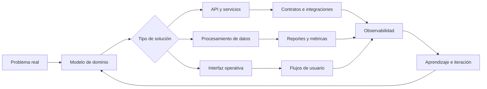

<div align="center">

# PipeFck

### Desarrollo sistemas que conectan datos, producto y operación

Transformo procesos complejos en **APIs**, **automatizaciones**,  
**productos de datos** e **interfaces útiles para las personas**.

<br />

<a href="https://github.com/PipeFck">
  
</a>
<a href="https://www.linkedin.com/in/felipe-castillo-12310a358/">
  
</a>


</div>

---

## 👨‍💻 Sobre mí

Soy desarrollador de software con foco en sistemas donde los datos necesitan
**moverse, validarse, transformarse y convertirse en decisiones o acciones**.

Me interesa trabajar sobre el ciclo completo de una solución:

- comprender el problema y modelar el dominio;
- diseñar APIs, contratos e integraciones;
- construir procesos de datos y automatizaciones;
- crear reportes, paneles y flujos operativos;
- desplegar, observar e iterar sobre el sistema.

> Una parte importante de mi trabajo profesional vive en repositorios privados.
> Este perfil muestra las capacidades, decisiones técnicas y áreas de trabajo que
> he desarrollado, sin exponer información confidencial ni asociar mi identidad
> a una empresa específica.

---

## 🧩 Mi perfil técnico

<table>
  <tr>
    <td width="25%" valign="top">
      <strong>🧠 Diseño de sistemas</strong>
      <br /><br />
      Modelado de dominio, separación de responsabilidades, contratos y evolución de arquitectura.
    </td>
    <td width="25%" valign="top">
      <strong>⚙️ Backend y APIs</strong>
      <br /><br />
      Servicios mantenibles, lógica de negocio, GraphQL, integraciones y procesamiento.
    </td>
    <td width="25%" valign="top">
      <strong>📊 Datos y reporting</strong>
      <br /><br />
      ETL, validación, transformación, observabilidad, métricas y productos de datos.
    </td>
    <td width="25%" valign="top">
      <strong>🖥️ Producto interno</strong>
      <br /><br />
      Paneles, back office, flujos operativos y herramientas orientadas al usuario.
    </td>
  </tr>
</table>

---

## 🔄 Cómo convierto un problema en un sistema



Mi objetivo no es agregar tecnología por agregarla, sino construir soluciones
que sean **comprensibles, trazables, mantenibles y útiles**.

---

## 🛠️ Experiencia aplicada

| Área | Qué construyo | Qué priorizo |
|---|---|---|
| **Sistemas de datos** | Procesos ETL, normalización, validaciones y monitoreo | Trazabilidad, calidad y recuperación ante errores |
| **Backend** | APIs, servicios, reglas de negocio e integraciones | Contratos claros, mantenibilidad y evolución |
| **Reporting** | Reportes, métricas y transformación de datos en información | Consistencia, contexto y utilidad |
| **Producto operativo** | Paneles, back office y flujos internos | Claridad, velocidad y reducción de fricción |
| **Automatización** | Tareas recurrentes, sincronizaciones y procesos asistidos | Confiabilidad, control y ahorro de trabajo manual |
| **Entrega** | Cloud, control de versiones y automatización de workflows | Repetibilidad, visibilidad y mejora continua |

---

## 🧰 Tecnologías

<div align="center">


</div>

<br />

| Enfoque | Tecnologías y herramientas |
|---|---|
| **Producto e interfaz** | TypeScript, Next.js, Tailwind CSS, Storybook |
| **Servicios y contratos** | NestJS, GraphQL, Python |
| **Sistemas y rendimiento** | Go, Rust |
| **Cloud y entrega** | AWS, Git, GitHub Actions |
| **Datos** | ETL, modelado, validación, reporting y observabilidad |

---

## 🎯 En qué estoy profundizando

- Arquitecturas orientadas a datos y dominios complejos.
- Go y Rust para servicios y herramientas eficientes.
- GraphQL como contrato entre producto y servicios.
- Observabilidad de procesos, integraciones y pipelines.
- Automatización de flujos técnicos y operativos.
- Experiencias de usuario para productos internos.

---

## 📈 Actividad y evolución

<picture>
  <source
    media="(prefers-color-scheme: dark)"
    srcset="https://github-profile-summary-cards.vercel.app/api/cards/profile-details?username=PipeFck&theme=github_dark"
  />
  <source
    media="(prefers-color-scheme: light)"
    srcset="https://github-profile-summary-cards.vercel.app/api/cards/profile-details?username=PipeFck&theme=github"
  />
  
</picture>

<br />

<picture>
  <source
    media="(prefers-color-scheme: dark)"
    srcset="https://github-readme-activity-graph.vercel.app/graph?username=PipeFck&theme=react-dark&hide_border=true&area=true&custom_title=Actividad%20reciente"
  />
  <source
    media="(prefers-color-scheme: light)"
    srcset="https://github-readme-activity-graph.vercel.app/graph?username=PipeFck&theme=github&hide_border=true&area=true&custom_title=Actividad%20reciente"
  />
  
</picture>

> Las visualizaciones anteriores se construyen con información pública de GitHub.
> El trabajo realizado en repositorios privados puede no aparecer reflejado.

---

## 🧭 Principios que guían mi trabajo

```text
Claridad antes que complejidad.
Datos trazables antes que resultados opacos.
Contratos estables antes que acoplamiento.
Automatización con control antes que automatización ciega.
Producto útil antes que tecnología llamativa.
```

---

## 🤝 Contacto

<div align="center">

¿Quieres conversar sobre arquitectura, backend, automatización o productos de datos?

<br /><br />

<a href="https://www.linkedin.com/in/felipe-castillo-12310a358/">
  
</a>
<a href="https://github.com/PipeFck">
  
</a>

<br /><br />

<sub>Construyendo sistemas que hacen que los datos sean útiles.</sub>

</div>
