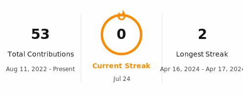

# Hey 👋, I'm PipeFck

### Software developer building modern web applications, APIs and data-driven solutions.

---

## 👨‍💻 About me

- 💻 Software developer interested in modern web and backend development.
- ⚙️ I enjoy building maintainable APIs, applications and data workflows.
- 🧠 Currently improving my knowledge of Go, Rust, GraphQL and cloud architecture.
- ☁️ Working with AWS and modern development tools.
- 🚀 Always interested in learning, improving and solving complex problems.

---

## 🛠️ Tech stack

### Frontend

  

  

  

  

  

### Backend

  

### Cloud

  

---

## 📊 GitHub analytics

  <picture>
    <source
      media="(prefers-color-scheme: dark)"
      srcset="./profile/stats-dark.svg"
    />
    <source
      media="(prefers-color-scheme: light)"
      srcset="./profile/stats-light.svg"
    />
    
  </picture>

  <picture>
    <source
      media="(prefers-color-scheme: dark)"
      srcset="./profile/languages-dark.svg"
    />
    <source
      media="(prefers-color-scheme: light)"
      srcset="./profile/languages-light.svg"
    />
    
  </picture>

 

  <picture>
    <source
      media="(prefers-color-scheme: dark)"
      srcset="./profile/streak-dark.svg"
    />
    <source
      media="(prefers-color-scheme: light)"
      srcset="./profile/streak-light.svg"
    />
    
  </picture>

---

## 🚀 Featured project

  <a href="https://github.com/PipeFck/monitoreo_etl">
    <picture>
      <source
        media="(prefers-color-scheme: dark)"
        srcset="./profile/monitoreo-etl-dark.svg"
      />
      <source
        media="(prefers-color-scheme: light)"
        srcset="./profile/monitoreo-etl-light.svg"
      />
      
    </picture>
  </a>

## 👾 My contribution graph

  <picture>
    <source
      media="(prefers-color-scheme: dark)"
      srcset="https://raw.githubusercontent.com/PipeFck/PipeFck/output/pacman-contribution-graph-dark.svg"
    />
    <source
      media="(prefers-color-scheme: light)"
      srcset="https://raw.githubusercontent.com/PipeFck/PipeFck/output/pacman-contribution-graph.svg"
    />
    
  </picture>

---

## 🤝 Connect with me

  

  <!-- Reemplaza TU_USUARIO por tu usuario real de LinkedIn -->
  

  <!-- Reemplaza TU_EMAIL por tu correo -->
  

 

  <i>Thanks for visiting my profile!</i>

